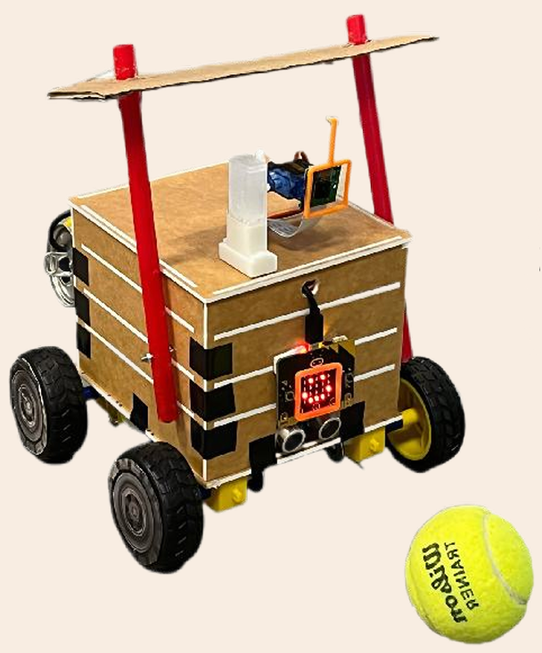

# Ball_Robot
Ball-playing robot with deep learning technology

# Hardware

- Laptop
- Arduino Uno
- Raspberry Pi 4
- Camera
- 4 DC motors
- 2 Servo motors (one for the camera and another for arms)
- Box boards for the robot body
- etc.

# Software

- Laptop
  - Detect the position of the ball and the master
  - send the actions to the Raspberry Pi
- Raspberry Pi
  - Control the motors and the servo motors
  - Receive the actions from the laptop
- Arduino Uno
  - Control the motors
  - Receive the actions from the Raspberry Pi

# Demo

